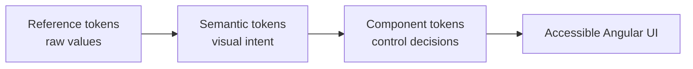

# Orbit

[](https://github.com/Rhaegal222/Orbit/actions/workflows/ci.yml)
[](https://www.npmjs.com/package/@rhaegal222/orbit)
[](https://angular.dev/)
[](LICENSE)
[](https://www.typescriptlang.org/)

**Theme-neutral, accessible UI foundations for Angular.**

Orbit pairs practical Angular primitives with a CSS-token contract that lets a
product adopt its own visual identity without forking component code. It is
built for dense application interfaces, keyboard use, responsive layouts and
long-lived design systems.

<p align="center">
  <a href="#quick-start">Quick start</a> ·
  <a href="#the-orbit-model">Design model</a> ·
  <a href="#component-map">Components</a> ·
  <a href="#development">Development</a>
</p>



## Quick start

Install Orbit alongside Angular CDK in an Angular 22 application:

```bash
npm install @rhaegal222/orbit @angular/cdk
```

Import the default theme once from the application’s global stylesheet:

```css
@import '@rhaegal222/orbit/styles';
```

Use standalone components directly from the single public entry point:

```ts
import { ChangeDetectionStrategy, Component } from '@angular/core';
import { OrbitButtonComponent } from '@rhaegal222/orbit';

@Component({
  selector: 'app-save-action',
  imports: [OrbitButtonComponent],
  changeDetection: ChangeDetectionStrategy.OnPush,
  template: `
    <orbit-button label="Save changes" tone="primary" />
  `,
})
export class SaveActionComponent {}
```

## The Orbit model

| Layer | Role | Example |
| --- | --- | --- |
| Reference | Raw colour, type and geometry values | `--orbit-ref-*` |
| Semantic | Meaningful UI intent | `--orbit-action-primary-bg` |
| Component | A deliberate local control mapping | `--orbit-button-*` |

This separation makes theming predictable: change semantic values at the
application boundary and all nested components inherit the result.

```css
:root {
  --orbit-action-primary-bg: #0f766e;
  --orbit-action-primary-bg-hover: #115e59;
  --orbit-radius-control: 0.625rem;
  --orbit-font-sans: Inter, system-ui, sans-serif;
}
```

Orbit includes a complete default theme, dark-theme-ready semantic surfaces,
four density modes (`spacious`, `comfortable`, `compact`, `dense`), shape
presets and a text-scale contract. Apply those choices on an application shell:

```html
<main data-orbit-density="compact" data-orbit-shape="operational">
  <!-- Orbit components inherit the selected design language. -->
</main>
```

## Component map

Orbit provides **51 reusable primitives**. Each component has a typed public
API and is designed to work with semantic tokens rather than utility classes.

| Area | Building blocks |
| --- | --- |
| **Inputs & forms** | Button, Checkbox, Switch, Select, Text Input, Autocomplete, Slider, Pill Switch, Date Picker, Time Picker, Date Range Picker, Form Field, Form Grid, Form Section, Form Action Bar |
| **Layout & navigation** | Page Shell, Page Header, Workspace, Stack, Cluster, Divider, Sidebar, Navbar, Breadcrumb, Tab, Tab Panel, Tablist, Pagination |
| **Data & status** | Table, Table Column, Table Row, Badge, Avatar, Chip, Skeleton, Progress Bar, Spinner, Alert, Banner, Toast |
| **Overlays & actions** | Modal, Modal Header, Modal Body, Modal Footer, Confirm Dialog, Panel, Panel Surface, Popover, Tooltip, Code Block |
| **Utilities** | Icon, Selectable Tile, Accordion, Attachment Dropzone, Attachment List, Attachment List Item, Auto Hide on Scroll |

## Built for real interaction

- **Accessible by default** — semantic HTML, visible focus treatment, typed
  labels and keyboard-aware overlay primitives.
- **Angular-native** — standalone components, OnPush change detection, signals
  and Angular CDK integration where it adds durable behaviour.
- **Token-first** — no brand assumptions and no requirement for consumers to
  adopt a utility framework.
- **Responsive by design** — density, touch-target and text-scale rules are
  part of the component contract rather than afterthoughts.
- **Composable** — small primitives combine into forms, panels, dialogs and
  data-heavy workflows without prescribing application state or routing.

## Internationalization

Orbit provides Italian defaults and an optional typed configuration for labels
and locale-aware controls:

```ts
import { provideOrbitI18n } from '@rhaegal222/orbit';

bootstrapApplication(AppComponent, {
  providers: [
    provideOrbitI18n({
      locale: 'en-GB',
      labels: { close: 'Close', select: 'Select…', noResults: 'No results' },
    }),
  ],
});
```

## Development

```bash
npm install
npm run lint           # lint with angular-eslint
npm run build:lib      # production library build
npm test               # unit tests
npm run check          # lint, build and test verification
```

### Compatibility

| Dependency | Supported version |
| --- | --- |
| Angular | `^22.0.0` |
| Angular CDK | `^22.0.0` |
| PrismJS | `^1.29.0` — needed for syntax highlighting in Code Block |
| Node.js | `>=22.22.3` for local development |

## License

MIT © 2026 Rhaegal222
